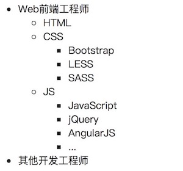

# 一、文本标签

- \<span>：文本标签，行内元素
- \<p>：段落标签，一般用于描述一个段落，块级元素
- \<h1~h6>：标题，块级元素
- \<hgroup>：当元素有多个层级时，该元素可以将`h1`到`h6`元素放在其内，譬如文章的主标题和副标题的组合

# 二、文本格式化标签

- 粗体：\<b>
- 斜体：\<i>
- 强调：\<strong>
- 上标：\<sup>
- 下标：\<sub>
- 大号字：\<big>
- 小号字：\<small>
- 插入字：\<ins>
- 删除字：\<del>
- 着重字：\<em>

# 三、引用/术语定义

- \<address>：作为联系信息出现，邮编地址、邮件地址等等，一般出现在footer标签中
- \<q>：短引用
- \<blockquote>：长引用
- \<cite>：该标签通常表示它所包含的文本对某个参考文献的引用，比如书籍或者杂志的标题。

# 四、布局标签/语义化标签

  HTML 提供了一系列标签用于布局，主要包括一下标签：

- div：布局标签（通用容器）


- article：用于文章、新闻或博客，表示文档、页面或应用或一个独立的容器，article可以嵌套article，只要里面的article与外面的article是部分与整体的关系。


- section：章节标签，表示具体相似主题的一组内容，比如网站的主页可以分成介绍、新闻条目、联系信息等条块。


- aside：指定附注栏，包括引述、侧栏、指向文章的一组链接、广告、友情链接、相关产品列表等。


- header：页眉，通常包括网站标志，主导航，全站链接及搜索框，也适合对页面内部一组介绍性或导航性内容进行标记。


- footer：页脚


- nav：标记导航，仅对文档中重要的链接使用。HTML5规范不推荐对辅助性页脚使用nav，除非页脚再次显示顶级全局导航，或者包含招聘信息等重要链接。


- small：指定细则，输入免责声明、注解、署名、版权。只适用于短语，不要用来标记“使用条款”、“隐私政策”等长的法律声明。


- figure：创建图（默认有40px左右margin）


- figcaption：figure的标题，必须是figure内嵌的第一个或者最后一个元素。


- time：标记时间

# 五、实用标签

## 1、

  img 标签主要用于显示图片，其主要常用属性如下：

- src：设置图片链接地址
- width/height：设置图片大小
- title：设置图片标题，鼠标悬浮在图片上时显示
- alt：设置提示，当图片加载失败时会显示

## 2、<a>

  a 标签主要用于超链接，HTML 使用超链接与网络上的另一个文档相连。几乎可以在所有的网页中找到链接。点击链接可以从一张页面跳转到另一张页面。其主要常用属性如下：

- href：链接地址，可以是本地链接地址，也可以是在线链接地址
- target：定义被链接的文档在何处显，其值包括：_blank、_self、_parent、_top以及iframe的name属性的值

  利用超链接可以跳转到本页锚点，类似于书签跳转，将a标签的“href”属性设置为“#”+“指定元素的ID值”后，该超链接不再是进行页面间的跳转或是文件的打开了，而是将页面滚动到本页面中ID属性值和“href”属性值“#”后的值所对应的值的地方，页面滚动的目标元素的上边缘将和浏览器内容窗口上边缘重合。

```html
<div id="anchor"></div>
<a href="#anchor">点击跳转到锚点</a>
```

  加上“download”属性，并指定一个文件下载后的名称即可实现通过超链接下载指定内容。

```html
<a href="https://timgsa.baidu.com/timg?image&quality=80&size=b9999_10000&sec=1495192801524&di=f7a9a7efe2fb76c80be2a65e634398a9&imgtype=0&src=http%3A%2F%2Fimg.car.mianfeiapp.net%2Fupload%2F20170510%2F1494402769592150.jpg"  download="Ferrari">点击下载</a>
```

  如果页面上布局了一个超链接，但是现在还不确定链接地址，可以使用 “#” 号替代 *href* 属性值，当然你也可以使用 *javascript:void(0)* 替代，建议用后者，使用前者未在URL资源地址后面追加“#”，从而改变 *location.href*。

  利用超链接也可以实现回到顶部的需求，即指定 *href* 属性值为 *#top*，但是这样设置时直接跳至顶部，给用户一种突兀的感觉，后期可通过 JavaScript + css 实现回到顶部的效果。

## 3、<iframe>

  iframe 标签会创建包含另外一个文档的内联框架（即行内框架），其主要属性包括：

- name：设置iframe的名称
- width：设置iframe的宽度，值可以为像素（不用添加“px”单位）和百分数
- height：设置iframe的高度，值可以为像素（不用添加“px”单位）和百分数
- src：设置iframe元素内需要显示页面或文件的URL地址，该属性的值可以由与之关联的a标签点击设置（通过将a标签的“target”属性的值设置为该iframe的“name”属性的值进行关联）
- frameborder：设置是否显示边框（0 表示不显示边框/ 1 表示要显示边框）
- scrolling：设置是否允许滚动（auto/yes/no）

## 4、<list>

  list，列表，html 包括无序列表、有序列表及定义列表，其显示类型为块级元素。

### a、无序列表 ul

  常用属性：

- type：列表项目符号类型（disc（默认）/circle/square）

  使用示例：

```html
<ul type="disc">
    <li>无序列表01</li>
    <li>无序列表02</li>
    <li>无序列表03</li>
</ul>
```

### b、有序列表 ol

  常用属性：

- type：列表项目符号类型（1（默认）/A/a/I/i）
- reversed：倒序
- start：起始值

  使用示例：

```html
<ol>
    <li>有序列表01</li>
    <li>有序列表02</li>
    <li>有序列表03</li>
</ol>
```

### c、定义列表 dl

  定义列表分为两层：第一层为定义的列表dl；第二层分为两个部分，即dt和dd，dt用于定义列表中的项目，dd用于描述定义的项目，它们的显示类型都为“块级元素（block）”。相对于“无序列表”和“有序列表”，这种列表由于其自身的结构原因，对需要进行名词性描述的列表更为适用。

```html
<dl>
    <dd>苹果</dd>
    <dt>苹果（学名：Malus pumila）是水果的一种，是蔷薇科苹果亚科苹果属植物，其树为落叶乔木。苹果的果实富含矿物质和维生素，是人们经常食用的水果之一。</dt>

    <dd>草莓</dd>
    <dt>草莓（学名：Fragaria × ananassa Duch.），多年生草本，高10-40厘米。茎低于叶或近相等，密被开.展黄色柔毛。叶三出，小叶具短柄，质地较厚，倒卵形或菱形，上面深绿色，几无毛，下面淡白绿色，疏生毛，沿脉较密；叶柄密被开展黄色柔毛。聚伞花序，花序下面具一短柄的小叶；花两性；萼片卵形，比副萼片稍长；花瓣白色，近圆形或倒卵椭圆形。聚合果大，宿存萼片直立，紧贴于果实；瘦果尖卵形，光滑。花期4-5月，果期6-7月。</dt>

    <dd>樱桃</dd>
    <dt>樱桃（学名：Cerasus pseudocerasus），是某些李属类植物的统称，包括樱桃亚属、酸樱桃亚属、桂樱亚属等。乔木，高2-6米，树皮灰白色。小枝灰褐色，嫩枝绿色，无毛或被疏柔毛。冬芽卵形，无毛。</dt>
</dl>
```

### d、列表嵌套

  无序列表与有序列表嵌套使用方式一致，这里以无序列表为例:

```html
<ul>
    <li>Web前端工程师
        <ul>
            <li>HTML</li>
            <li>CSS
                <ul>
                    <li>Bootstrap</li>
                    <li>LESS</li>
                    <li>SASS</li>
                </ul>
            </li>
            <li>JS
                <ul>
                    <li>JavaScript</li>
                    <li>jQuery</li>
                    <li>AngularJS</li>
                    <li>...</li>
                </ul>
            </li>
        </ul>
    </li>
    <li>其他开发工程师</li>
</ul>
```

  示例效果：




## 5、<table>

  table 标签主要用于定义HTML表格

### a、相关概念

- thead：表头（表格标题及头部信息不等）
- tbody：表中（表格显示的内容部分）
- tfoot  ：表尾（表格说明与备注部分）
- tr：行
- th：单元格，作为行或列的标题呈现
- td：单元格，作为内容单元格呈现
- caption：表格主标题，位于表格之外

### b、相关属性

- width/height：设置宽度/高度
- border：设置边框
- align：设置表格对齐方式（left/center/right）
- cellspacing：设置单元格与单元格之间的间距
- cellpadding：设置单元格与内容之间的间距
- bgcolor：设置表格背景颜色
- background：设置背景图片
- colspan：跨列 ‘*\<td colspan="2">\</td>*’
- rowspan：跨行 ‘*\<td rowspan="2">\</td>*’

## 6、<details>

  details 标签用于描述文档或文档某个部分的细节，目前只有 Chrome 和 Safari 6 支持 details 标签。，该标签需与 summary 标签结合使用。其使用方法如下：

```html
<details>
	<summary>苹果</summary>
	<p>苹果（学名：Malus pumila）是水果的一种，是蔷薇科苹果亚科苹果属植物，其树为落叶乔木。苹果的果实富含矿物质和维生素，是人们经常食用的水果之一。</p>
</details>
```

## 7、<mark>

  mark 标签定义带有记号的文本。请在需要突出显示文本时使用此标签。如下所示：

```html
<p>2015年3月5日上午十二届全国人大三次会议上,李克强总理在政府工作报告中首次提出 <mark>互联网+</mark> 行动计划</p>
```

## 8、<progress>

  progress 标签用于描述进度信息，其具备如下两个属性：

- max：规定总进度量的值
- value：规定当前进度量的值

  代码示例：

```html
<main>
	<span>下载中：</span>
	<progress>
</main>

<main>
	<span>当前进度：</span>
	<progress value="50" max="100">
</main>
```

## 9、<audio>

  该标签是一个“行内块级元素”,它用于在页面中加载音频文件，目前HTML5标准中，\<audio>主要支持三种格式的音频文件，即：“ogg”(Ogg Vorbis)、“mp3”和“wav”格式的音频文件，但不同的浏览器支持的情况又有所不同，所以我们通常不会单独使用\<audio>标签，而是在该标签内置入一个\<source>标签，使浏览器将一个识别到的音频文件进行使用。

  浏览器支持音频格式的情况如下表：


  audio 标签常用属性如下：

- autoplay：自动播放
- controls：显示音频控件（播放/暂停按钮等）
- loop：循环播放
- muted：静音
- preload：预加载，与autoplay连同使用，该属性会被忽略
- src：音频地址

  source 标签常用属性如下：

- media：规定媒体类型，如：“*screen and (min-width:320px)*”
- src：规定媒体文件的URL地址
- type：规定媒体资源的MIME类型（Multipurpose Internet Mail Extensions，它包含文本、图像、音频、视频以及其他应用程序专用的数据）

  audio 标签兼容各种浏览器的写法如下：

```html
<audio controls preload>
	<source src="media/SmallLucky.mp3" type="audio/mpeg">
	<source src="media/SmallLucky.ogg" type="audio/ogg">
</audio>
```

## 10、<video>

  该标签是一个“行内块级元素”,它用于在页面中加载*视频*文件，目前HTML5标准中，\<audio>主要支持三种格式的视频文件，即：“ogg/ogv”(带有Theora视频编码和Vorbis音频编码的Ogg文件)、“mp4”（带有H.264 视频编码和AAC音频编码的MPEG4文件）和“webm”（带有VP8视频编码和Vorbis音频编码的WebM文件）格式的视频文件，但不同的浏览器支持的情况又有所不同，所以我们通常不会单独使用\<video>标签，而是在该标签内置入一个\<source>标签，使浏览器将一个识别到的音频文件进行使用。

  浏览器支持视频格式的情况如下表：


  video 标签常用属性如下：

- width：设置音频播放器的宽度
- height：设置音频播放器的高度
- autoplay：自动播放
- controls：显示音频控件（播放/暂停按钮等）
- loop：循环播放
- preload：预加载，与autoplay连同使用，该属性会被忽略
- src：音频地址

  audio 标签兼容各种浏览器的写法如下：

```html
<video width="500" height="300" controls preload>
	<source src="media/chuai.mp4" type="video/mp4">
	<source src="media/chuai.ogg" type="video/ogg">
</video>
```

## 11、<hr>

  \<hr> 标签用于设置水平线，其常用属性如下：

- width：设置水平线宽度
- color：设置水平线颜色


