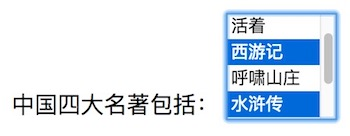
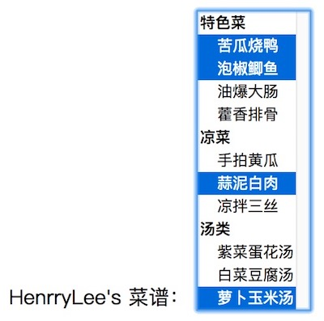
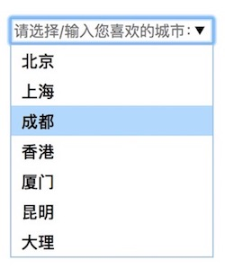

# 一、简介

  [HTML](http://baike.baidu.com/item/HTML) 表单用于搜集不同类型的用户输入。[表单](http://baike.baidu.com/item/%E8%A1%A8%E5%8D%95)是一个包含表单元素的区域。表单元素是允许用户在表单中（比如：文本域、下拉列表、单选框、复选框等等）输入信息的元素。表单使用表单标签（\<form>）定义。

  表单标签的内容通常是“表单元素”+“提交按钮”的形式。它虽然和\<div>标签一样属于“块级元素”，但它却有自己的实际用处，也就是若不将“表单元素”放置于表单标签\<form>中，那某些表单元素将会失效，如：“提交”按钮和“重置”按钮。

# 二、表单

  表单使用 \<form>标签定义，\<form>标签具备以下属性：

- name：规定识别表单的名称


- action：规定向何处提交表单的地址（URL）（提交页面）


- method：规定在提交表单时所用的 HTTP 方法（默认：GET），其值包括：
  - GET：form表单里所填的值，附加在action指定的URL后面，做为URL链接而传递。
  - POST：form表单里所填的值，附加在HTML Headers上。


- target：规定在何处打开“action”中设定的URL（默认：_self），有以下值：
  - \_blank：在新窗口/选项卡中打开
  - \_self：当前页打开
  - \_parent：在父框架中打开
  - \_top：在整个窗口中打开
  - \<iframe> 的 “*name*” 值：指定框架中打开


- enctype：规定在发送表单数据之前，如何对表单数据进行编码，有以下值：
  - application/x-www-form-urlencoded（默认，在发送前编码所有字符）
  - multipart/form-data（不对字符编码，在使用包含文件上传控件的表单时，必须使用该值
  - text/plain（空格转换为 "+" 加号，但不对特殊字符编码。）


- autocomplete：规定是否启用表单的自动完成功能（默认开启：on）（on/off）
- novalidate：规定浏览器不验证表单。
- accept-charset：规定在被提交表单中使用的字符集，主要有一下值
  - UTF-8（Unicode，双字节对字符进行编码，统一的编码标准）
  - ISO-8859-1（拉丁字母表的字符编码）
  - GB2312（简体中文字符集）

> 提示：当然，还有其它更多字符集的编码标准，这里作为了解即可，如：“ISO-8859-2”（东欧字符编码），“ISO-2022-JP”和“ISO-2022-JP-2”（日语字符编码），“ISO-2022-KR”（韩语字符编码）等。

# 三、表单元素

## 1、< label >

  表单中用于显示表单字段的标签，可以让用户知道该行表单元素的作用，它属于“行级元素”。和\<span>标签不一样，它配合后面学习的其它表单元素可以实现一些作用上的关联。所以，标准的表单编写都需要在表单元素前加上一对\<label>标签，内容需写上标签后表单元素的作用。

## 2、< input >

  \<input> 标签用于搜集用户信息。根据不同的 type 属性值，输入字段拥有很多种形式。可以是文本字段、复选框、掩码后的文本控件、单选按钮、按钮等等。

### a、常用属性

- type：规定表单类型。
- name：定义 input 元素的名称。
- value：规定“文本类型”的输入框中，默认显示的值内容。
- maxlength：规定输入字段中的字符的最大长度。
- readonly：使表单元素成为“只读”状态，在这个状态下只能读取元素内容，而不能进行编辑。
- disabled：使表单元素成为“禁用”状态，表单元素将“失效”。
- checked：使“type”属性值为“checkbox”和“radio”的表单元素中的指定项默认成为“选中”状态。
- size：规定文本框可见字符显示的宽度，但不同浏览器对此的支持有所不同，我们现在基本都是使用CSS去控制。
- autocomplete：规定是否使用输入字段的自动完成功能。（*html5*）
- autofocus：规定输入字段在页面加载时是否获得焦点。（不适用于 type="hidden"）（*html5*）
- form：规定输入字段所属的一个或多个表单。（*html5*）
- height：规定 input 字段的高度。（适用于 type="image"）（*html5*）
- width：规定 input 字段的宽度。（适用于 type="image"）（*html5*）
- list：引用包含输入字段的预定义选项的 datalist 。（*html5*）
- multiple：多选（适用于select/datalist）。（*html5*）
- pattern：规定输入字段的值的模式或格式。例如 pattern="[0-9]" 表示输入值必须是 0 与 9 之间的数字。（*html5*）
- placeholder：规定帮助用户填写输入字段的提示。（*html5*）
- required：指示输入字段的值是必需的。（*html5*）
- step：规定输入字的的合法数字间隔。（*html5*）

### b、type属性值

- text：默认属性值，规定显示的类型为“文本框”
- password：规定显示的类型为“密码框”
- radio：规定显示的类型为“单选框”
- checkbox：规定显示的类型为“复选框”
- file：规定显示的类型为“文件上传”控件
- button：规定显示的类型为“按钮”
- submit：规定显示的类型为“提交按钮”
- reset：规定显示的类型为“重置按钮”
- image：规定显示的类型为“图像按钮”
- hidden：规定显示的类型为“隐藏域”
- email：用于应该包含“e-mail”地址的输入框（*html5*）
- url：用于应该包含“URL”地址的输入框（*html5*）
- search：用于应该“搜索内容”的输入框（*html5*）
- number：用于应该包含“数值”的输入控件（*html5*）
- tel：规定显示的类型为“电话号码”的输入框（*html5*）
- range：规定显示的类型为“数值选择范围”选择控件（*html5*）
- date：规定显示的类型为“日期”选择控件（*html5*）
- month：规定显示的类型为“月份”选择控件（*html5*）
- week：规定显示的类型为“周”选择控件（*html5*）
- time：规定显示的类型为“时间”选择控件（*html5*）
- datetime：规定显示的类型为“日期时间”选择控件（*html5*）
- datetime-local：规定显示的类型为“本地日期时间”选择控件（*html5*）
- color：规定显示的类型为“颜色”选择控件（*html5*）


## 3、< textarea >

  \<textarea> 标签是一个可以输入多行文本的标签对，它是一个“行内块级标签”。和 \<input> 标签不同的是，\<textarea> 标签是一个标签对，它拥有闭合标签。需要特别加以区分的是，它显示文本内容是通过标签的内容，而非“value”属性。它可以通过“cols”和“rows”属性来设置显示的尺寸，当然,使用CSS去控制尺寸更加利于布局准确性。

## 4、< select >

  通过\<select>标签可以创建单选和多选的下拉菜单。可以通过“size”属性设置该标签在一个选项菜单中可见的选项个数，当它的值设为“1”时，将显示为默认的\<select>下拉菜单的样式，\<option>是它必须的子菜单，否则将不能提供任何可选项，而\<option>标签通常需要具有一个“value”属性，以便于在做数据操作时能准确地通过该属性值取到对应标签的内容。

### 1）单选下拉菜单示例

```html
<form name="myForm" action="javascript:(void);" method="POST" target="_blank">
	<label>英雄联盟被称为法术机关枪的英雄是：</label>
	<select>
		<option value="0">皎月女神·戴安娜</option>
		<option value="1">符文法师·瑞&nbsp;&nbsp;&nbsp;&nbsp;兹</option>
		<option value="2">机械先驱·维克托</option>
		<option value="3">暗黑元首·辛德拉</option>
		<option value="4">远古巫灵·泽拉斯</option>
	</select>	
</form>
```

  效果演示：


### 2）多选下拉菜单示例

```html
<form name="myForm" action="javascript:(void);" method="POST" target="_blank">
	<label>中国四大名著包括：</label>
	<select multiple>
		<option value="0">战争与和平</option>
		<option value="1">活着</option>
		<option value="2">西游记</option>
		<option value="3">呼啸山庄</option>
		<option value="4">水浒传</option>
		<option value="5">红楼梦</option>
		<option value="6">三国演义</option>
	</select>	
</form>
```

  效果演示：



> 提示：在“windows操作系统”中按住“Ctrl”按钮，在“mac操作系统”中按住“command”按钮来选择多个选项，选择多个项的操作类似于操作系统中选择文件的操作。

### 3）分组下拉菜单示例

```html
<form name="myForm" action="javascript:(void);" method="POST" target="_blank">
	<label>HenrryLee's 菜谱：</label>
	<select multiple size="13">
		<optgroup label="特色菜">
			<option value="0">苦瓜烧鸭</option>
			<option value="1">泡椒鲫鱼</option>
			<option value="2">油爆大肠</option>
			<option value="3">藿香排骨</option>
		</optgroup>
		<optgroup label="凉菜">
			<option value="4">手拍黄瓜</option>
			<option value="5">蒜泥白肉</option>
			<option value="6">凉拌三丝</option>
		</optgroup>
		<optgroup label="汤类">
			<option value="7">紫菜蛋花汤</option>
			<option value="8">白菜豆腐汤</option>
			<option value="9">萝卜玉米汤</option>
		</optgroup>
	</select>	
</form>
```

  效果演示：



## 5、< button >

  \<button> 标签对和其它表单元素一样，同是属于“行内块元素”，它的作用和“type”属性为“button/submit/reset”的\<input>一样，是在页面内创建一个“按钮”元素，它的“type”属性和\<input>也一样，支持“button”、“submit”和“reset”三个值。它也是一个拥有闭合标签的元素。

  和使用\<input type="button">相比，使用\<button>有以下不同：

- \<button>按钮文本是放置于该标签的内容上，而\<input>是将按钮文本设置于它的“value”属性上
- 在页面提交时，“IE浏览器”提交的是\<button>标签对内的内容，而其它浏览器提交的是\<button>的“value”属性值的内容
- \<button>标签对内可以同时显示文本、图片、表格甚至是多媒体，而\<input>标签只能显示其中一个
- \<button>标签的“type”属性不进行设置的话，在“IE浏览器”中将默认设为“button”，而在其它浏览器中（包括 W3C 规范）都会默认设为“submit”，所以，为了统一浏览器的行为，我们通常都会为\<button>的属性“type”设置一个初始值
- 在外观上\<button>标签比\<input>标签生成的按钮更加有质感，交互视觉效果也更加出色（大部分浏览器如此）

  代码示例：

```html
<form name="myForm" action="javascript:(void);" method="POST" target="_blank">
	<button type="button" value="普通按钮">普通按钮</button>
	<button type="submit" value="提交按钮">提交按钮</button>
	<button type="reset"  value="重置按钮">重置按钮</button>
</form>
```

## 6、< datalist >

  使用 \<datalist> 标签可以实现下拉列表，需要配合一个属性为“list”的\<input>标签使用，通过将list的属性值设置为\<datalist>标签的“ID”属性的值来关联，实现一个既可输入，又可选择的下拉菜单。当然，IE浏览器不支持该元素。

```html
<form name="myForm" action="javascript:(void);" method="POST" target="_blank">
	<input type="text" name="cityIpt" placeholder="请选择/输入您喜欢的城市：" size="25" list="citys">
	<datalist id="citys">
		<option>北京</option>
		<option>上海</option>
		<option>成都</option>
		<option>香港</option>
		<option>厦门</option>
		<option>昆明</option>
		<option>大理</option>
	</datalist>
</form>
```

  效果演示：



## 7、< fieldset >

  fieldset 元素可将表单内的相关元素分组。

```html
<form name="myForm" action="javascript:(void);" method="POST" target="_blank">
	<fieldset style="width:370px;">
		<legend>健康信息</legend>
		<label for="height">身高：</label><input type="text" id="height" name="healthInfor">
		<label for="weight">体重：</label><input type="text" id="weight" name="healthInfor">
	</fieldset>
</form>
```

  效果演示：


